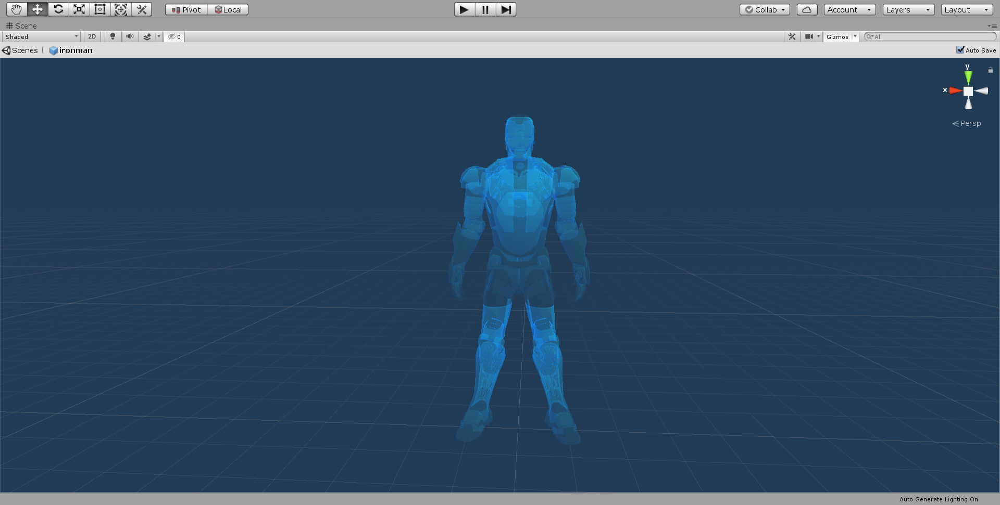
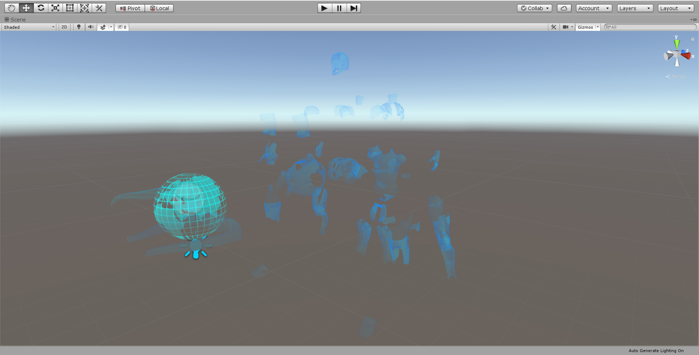
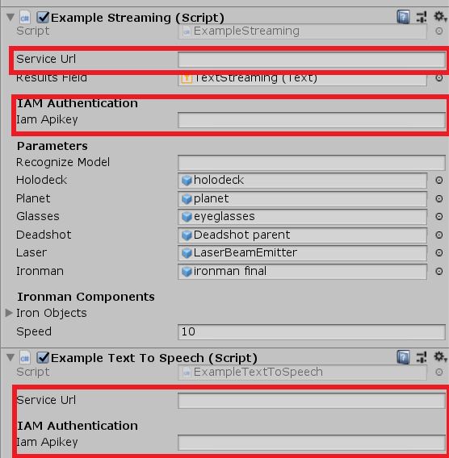
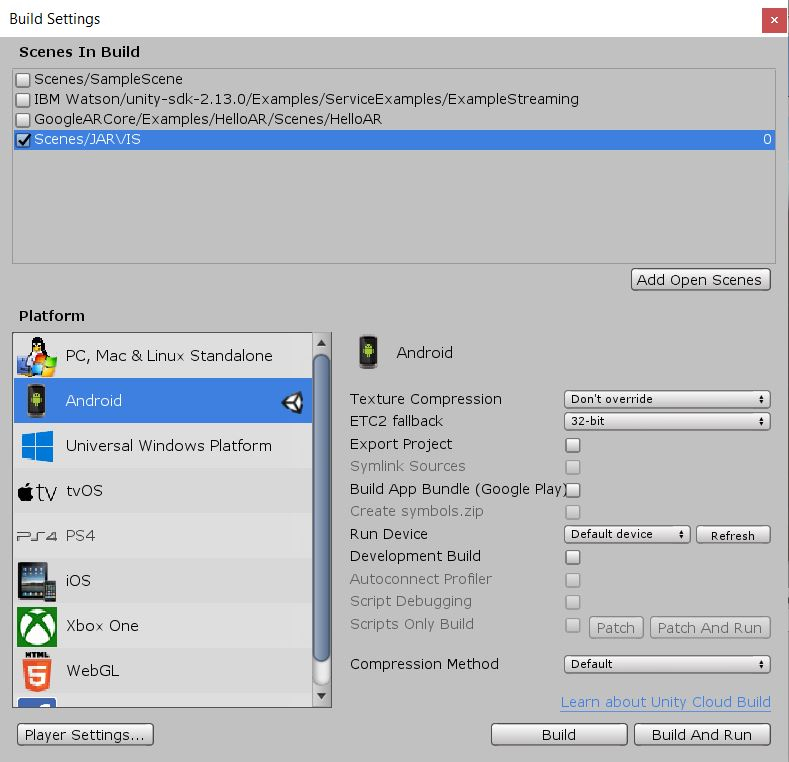

# AI Assistant JARVIS

This project is based on the renowned fictional AI JARVIS.

JARVIS is an AR avatar with some extra features such as voice-enabled chatbot that brings a human-like conversational experience and performs some AI operations. This pattern shows some operations that are performed using speech recognition, blending virtual objects into the real world.

The core technologies used in this project are Augmented Reality and Artificial Intelligence. Both AR and AI can be used to create unique and immersive experiences. I am using Unity which is a very powerful cross-platform game engine to develop real-time AR/VR, simulations and other experiences.

Checkout the [video](https://youtu.be/QSZk0DFNX5k) for demo.

    Note: This video has been recorded using Third-Party application due to some technical issues.The video and audio may not be synchronized properly at some positions. Real-Time working is better than it's shown in the video.

## Screenshots

 

 

 

## Tools and Services used

* [Unity](https://unity.com/) - Game Engine used to create simulation.
* [Google ARCore SDK for Unity](https://developers.google.com/ar) - To build and integrate AR experience.
* [IBM Watson for Unity v2.13.0](https://github.com/watson-developer-cloud/unity-sdk) - for chatbot experience.
* [IBM Watson Speech to Text](https://www.ibm.com/cloud/watson-speech-to-text)
* [IBM Watson Text to Speech](https://www.ibm.com/cloud/watson-text-to-speech)

## Work

The main logic for all the operations relies in these two prominent scripts -

* [ExampleStreaming](https://github.com/pkunjam/AI-Assistant-JARVIS-/blob/master/AI-Assistant-(JARVIS)/Assets/IBM%20Watson/unity-sdk-2.13.0/Examples/ServiceExamples/Scripts/ExampleStreaming.cs)
* [ExampleTextToSpeech](https://github.com/pkunjam/AI-Assistant-JARVIS-/blob/master/AI-Assistant-(JARVIS)/Assets/IBM%20Watson/unity-sdk-2.13.0/Examples/ServiceExamples/Scripts/ExampleTextToSpeech.cs)

 

Watson Speech-To-Text converts the audio to text through ExampleStreaming script which is responsible for listening and converting speech to text and eventually performs corresponding operations with it.

User interacts in AR and gives voice commands such as "Are you there?". 

 

    if (alt.transcript.Contains("are you") && State.Contains("Final")) // Jarvis you there? 
    {
          StopRecording();
          StartCoroutine(ExampleTextToSpeech.I1_AreYouThere());       //When it detect these words it will execute a Coroutine in the Text to Speech script.
          StartCoroutine(wait(4));
    }

    if (text.Contains("design") && State.Contains("Final")) // Bring up design interface
    {
          StopRecording();

          StartCoroutine(ExampleTextToSpeech.I2_Design());
          Holodeck.gameObject.SetActive(true);                      //Activates game object/s on Command.

          StartCoroutine(wait(4));
    }

 

When the phone's microphone receives the voice command, It is sent to ExampleTextToSpeech which converts the response text into speech which results as an audio output and waits for the next voice command.

 

    case 1:
        _testString = "<speak version=\"1.0\"><prosody pitch=\"110Hz\">For you sir? Always.</prosody></speak>";  // Jarvis you there?
        Runnable.Run(Jarvis()); // Execute the TTS engine.
        SpeakState = 0;
        break;
    case 2:
        _testString = "<speak version=\"1.0\"><prosody pitch=\"110Hz\">We're online and ready.</prosody></speak>"; // Bring up design interface
        Runnable.Run(Jarvis());
        SpeakState = 0;
        break;
    case 3:
        _testString = "<speak version=\"1.0\"><prosody pitch=\"110Hz\">With pleasure sir.</prosody></speak>"; // open up project edith prototype
        Runnable.Run(Jarvis());
        SpeakState = 0;
        break;

 

## Building and Running

    Note: This project has been compiled and tested using Unity 2019.2.12f1 and IBM Watson SDK for Unity 2.13.0.
    
Before building this project you have to create required IBM Cloud services. Sign up for IBM Cloud if you haven't already.
 
IBM Cloud instructions,
 
 1. Create a [Text-To-Speech](https://www.ibm.com/cloud/watson-text-to-speech) service.
 2. Create a [Speech-To-Text](https://www.ibm.com/cloud/watson-speech-to-text) service. 
 3. Save the service credentials for both the services in a txt file for convinience.
 
 Refer to this video [video](https://www.youtube.com/watch?v=xKzSzTvRH68) for help.
 
 Now open the Unity project,
 
 1. Open the JARVIS scene inside the scenes folder.
 2. Select ExampleStreaming gameobject in the heirarchy window.
 3. Fill out the Iam Apikey and service URL values from the saved txt file, in the corresponding component fields.

 

 

 4. To build, File -> Build Settings(Ctrl + Shift + B), select Android from the platform list, click "Add Open Scenes" and check "Scenes/JARVIS" only(uncheck others if checked already).
 
 

 

5. Click "Build and Run" (Ctrl + B).
6. Follow the instructions as per my demo [video](https://youtu.be/QSZk0DFNX5k).
7. Enjoy!

## Contributing

You are welcome to contribute -

1. Fork it!
2. Create your feature branch: `git checkout -b my-new-feature`
3. Commit your changes: `git commit -am 'Add some feature'`
4. Push to the branch: `git push origin my-new-feature`
5. Submit a pull request :D

## License

This project is licensed under the [GNU General Public License v3.0](LICENSE).
